# **P Store**

**P Store** là một dự án thương mại điện tử tập trung vào các sản phẩm bền vững và thân thiện với môi trường. Mục tiêu của chúng tôi là mang đến những sản phẩm chất lượng cao, giảm thiểu tác động xấu đến môi trường, và xây dựng thói quen tiêu dùng bền vững.

## **Mục lục**

<!-- AUTO-GENERATED-CONTENT:START (TOC:collapse=true&collapseText="Nhấn để xem mục lục") -->

Nhấn để xem mục lục

- [**1. Mục tiêu dự án**](#1-mục-tiêu-dự-án)
- [**2. Các tính năng chính**](#2-các-tính-năng-chính)
  - [2.1. Xác Thực & Phân Quyền Người Dùng](#21-xác-thực--phân-quyền-người-dùng)
  - [2.2. Quản Lý Sản Phẩm](#22-quản-lý-sản-phẩm)
  - [2.3. Quản Lý Giỏ Hàng](#23-quản-lý-giỏ-hàng)
  - [2.4. Quản Lý Đơn Hàng](#24-quản-lý-đơn-hàng)
  - [2.5. Quản Lý Mã Giảm Giá](#25-quản-lý-mã-giảm-giá)
  - [2.6. Quản Lý Địa Chỉ](#26-quản-lý-địa-chỉ)
  - [2.7. Quản Lý Giao Hàng](#27-quản-lý-giao-hàng)
  - [2.8. Tải Lên & Quản Lý Tập Tin](#28-tải-lên--quản-lý-tập-tin)
  - [2.9. Quản Lý Thanh Toán](#29-quản-lý-thanh-toán)
- [**3. Kiến trúc hệ thống**](#3-kiến-trúc-hệ-thống)
- [**4. Hình ảnh thực tế**](#4-hình-ảnh-thực-tế)
- [**5. Triển khai dự án**](#5-hướng-dẫn-cài-đặt-và-chạy-dự-án)

<!-- AUTO-GENERATED-CONTENT:END -->

## **1. Mục tiêu dự án**

- **Xây dựng nền tảng thương mại điện tử** chuyên bán các sản phẩm bền vững.
- **Mang lại trải nghiệm mua sắm trực quan và thân thiện** cho người tiêu dùng.
- **Tăng nhận thức cộng đồng** về tiêu dùng xanh và bền vững.

## **2. Các tính năng chính**

### 2.1. Xác Thực & Phân Quyền Người Dùng

- Đăng ký, đăng nhập bằng email và mật khẩu.
- Đăng nhập qua Google.
- Xác minh email, đặt lại mật khẩu.
- Quản lý vai trò và quyền hạn.

### 2.2. Quản Lý Sản Phẩm

- Tạo, cập nhật, xóa sản phẩm.
- Quản lý danh mục, thuộc tính, biến thể, và SKU.
- Xuất bản/gỡ xuất bản sản phẩm.

### 2.3. Quản Lý Giỏ Hàng

- Thêm, cập nhật, xóa sản phẩm trong giỏ.
- Xóa sạch giỏ hàng.
- Lấy thông tin chi tiết giỏ hàng.

### 2.4. Quản Lý Đơn Hàng

- Tạo, cập nhật, quản lý đơn hàng.
- Áp dụng mã giảm giá, tính phí giao hàng.
- Cập nhật trạng thái đơn hàng, điều chỉnh tồn kho.

### 2.5. Quản Lý Mã Giảm Giá

- Tạo, cập nhật, xóa mã giảm giá.
- Xác thực và áp dụng mã giảm giá, quản lý giới hạn và thời hạn sử dụng.

### 2.6. Quản Lý Địa Chỉ

- Thêm, cập nhật, xóa địa chỉ người dùng.
- Đặt địa chỉ giao hàng mặc định.
- Lấy gợi ý địa chỉ từ API bên ngoài.

### 2.7. Quản Lý Giao Hàng

- Tạo, cập nhật, xóa phương thức giao hàng.
- Tính phí dựa trên khoảng cách/phương thức.
- Kích hoạt hoặc vô hiệu hóa phương thức giao hàng.

### 2.8. Tải Lên & Quản Lý Tập Tin

- Tải lên/quản lý hình ảnh sản phẩm qua Cloudinary.
- Xóa tập tin cục bộ sau khi tải lên thành công.

### 2.9. Quản Lý Thanh Toán

- Hỗ trợ thanh toán qua MoMo với thẻ ATM.
- Thẻ ATM mẫu để test: `9704000000000018`, ngày hết hạn: `03/07`, tên chủ thẻ: `NGUYEN VAN A`, OTP (cần tạo khi test).

## **3. Kiến trúc hệ thống**

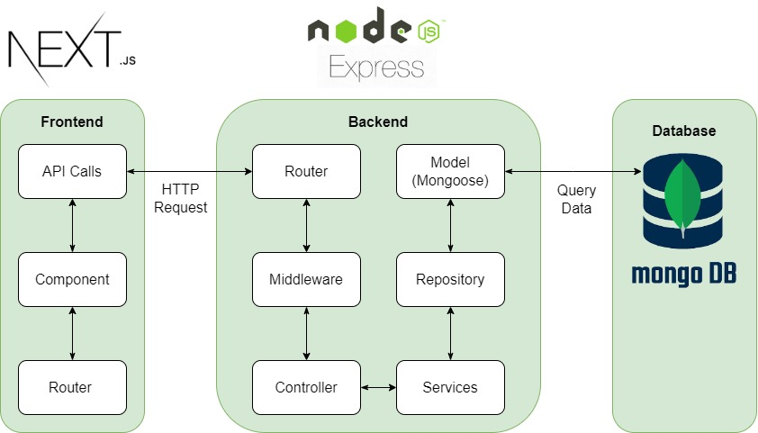

- **Backend**: Node.js/Express với các middleware như `cors`, `helmet`, `express-session`, và quản lý API qua `/v1/api`.
- **Frontend**: [React hoặc framework tương tự], tích hợp với backend qua API và hỗ trợ tải lên file.
- **Database**: [MongoDB hoặc PostgreSQL] cho quản lý sản phẩm, đơn hàng, và người dùng.
- **Deployment**: Frontend và backend được triển khai riêng biệt (xem phần [Triển khai](#6-triển-khai-deployment)).

## **4. Hình ảnh thực tế**

Dưới đây là một số ảnh chụp màn hình thể hiện các tính năng chính của P Store:

- **Architecture**: 
- **Docs**: 
- **Architecture Image**: 
- **Cart**: 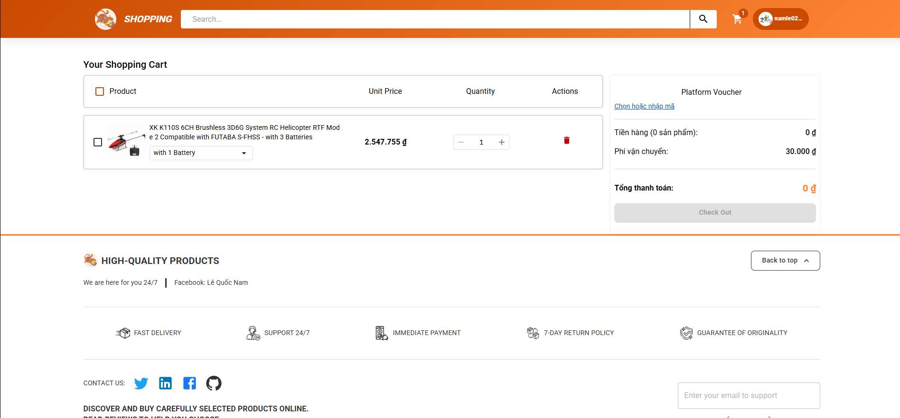
- **Checkout**: 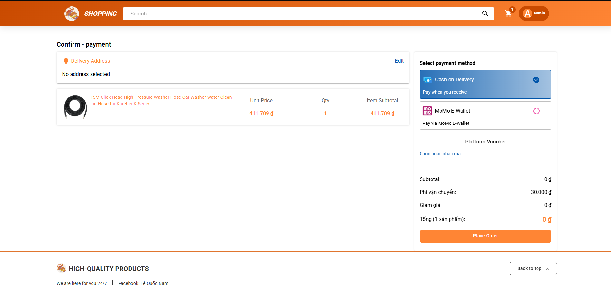
- **Home**: 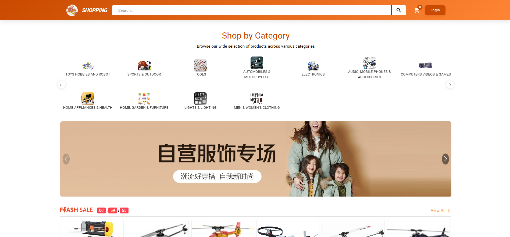
- **Home 1**: 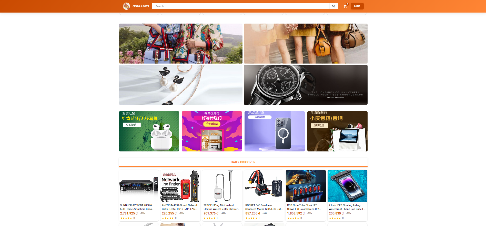
- **Home 2**: 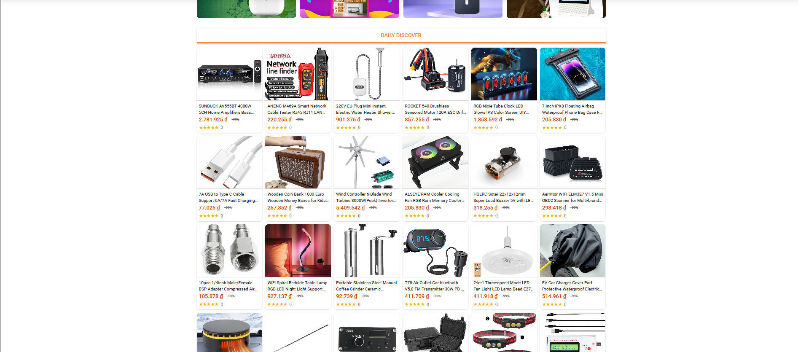
- **Home 3**: 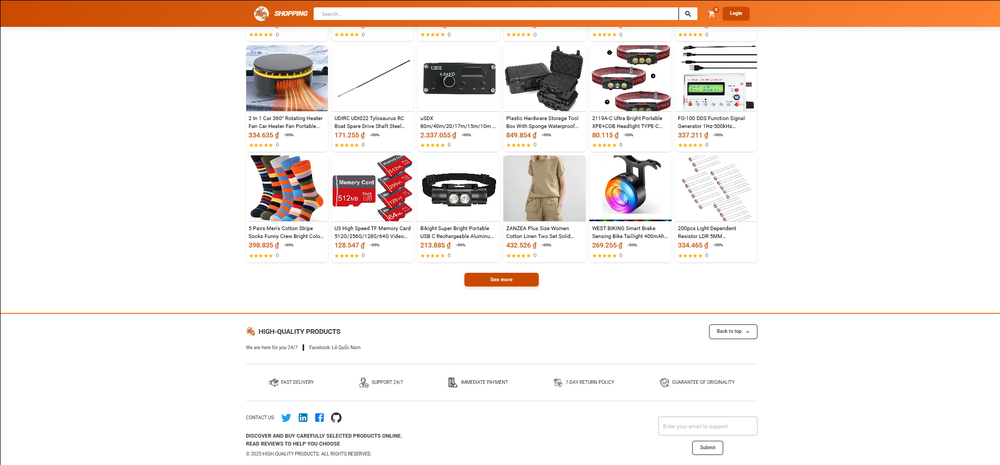
- **Login**: 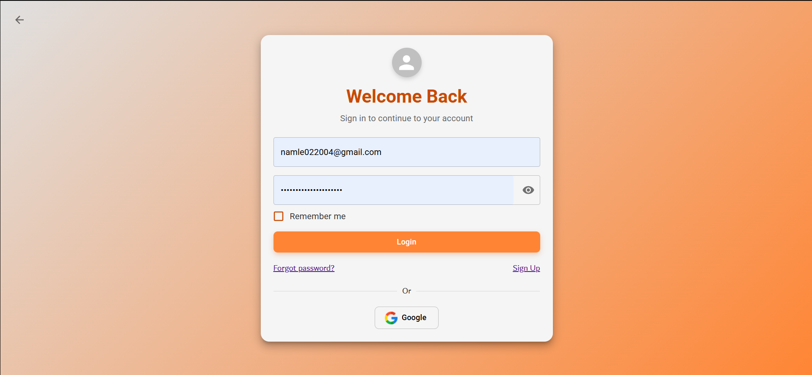
- **Manage**: 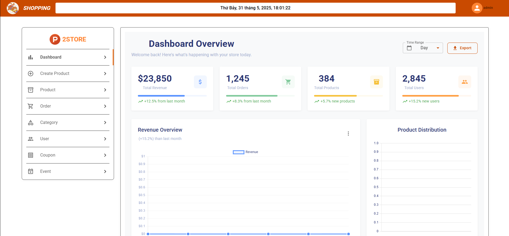
- **Product**: 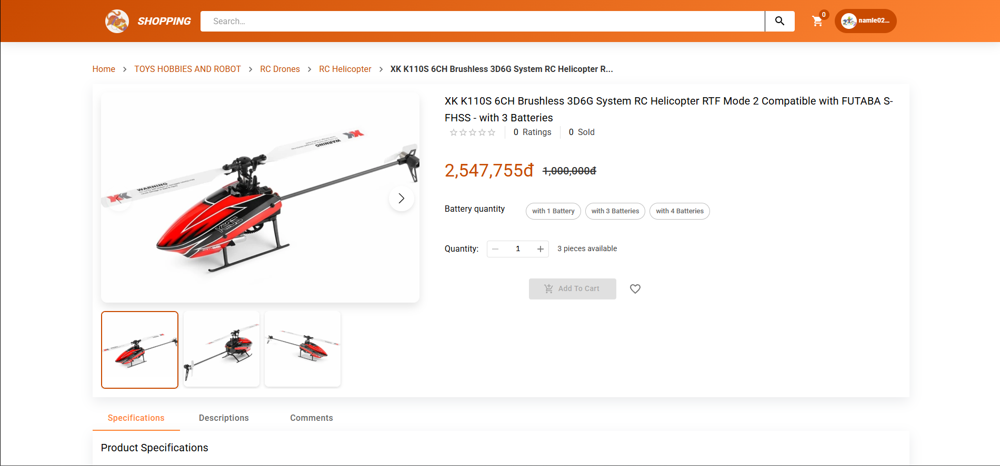
- **Search**: 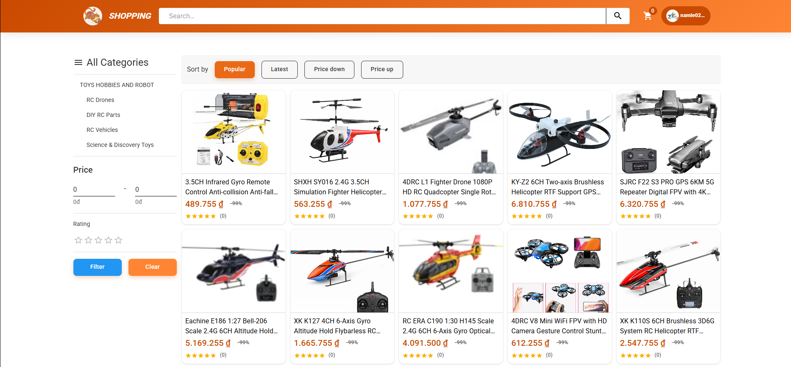

_Lưu ý_: Đảm bảo các file hình ảnh được đặt trong thư mục `docs/images/` trong repository để hiển thị đúng trên GitHub.

## **5. Triển khai dự án**
